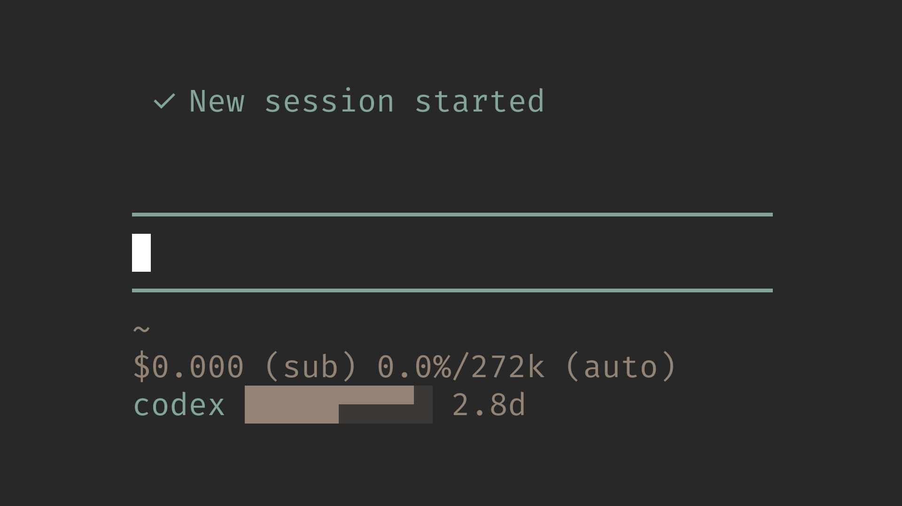

# pi-codex-usage

> Minimal zero-configuration Pi extension for showing primary ChatGPT Codex usage limits in the statusline



This repository is a minimal fork of [`narumiruna/pi-extensions/extensions/pi-codex-usage`](https://github.com/narumiruna/pi-extensions/tree/main/extensions/pi-codex-usage). It keeps the auth and quota-fetching path, but intentionally narrows the interface to the primary Codex 5-hour and weekly limits.

## Start Here

- [Agent Notes](./AGENTS.md)
- [Backlog](./BACKLOG.md)
- [Changelog](./CHANGELOG.md)

## Features

- Shows two counter-moving half-height markers in the statusline bar while the active Codex/Spark quota bucket is loading, then refreshes every 30 seconds
- Keeps the last usable active-bucket bar visible during ordinary refreshes instead of replacing known quota with a loading state
- Statusline output stays compact, with the active usage label accented and the quota bar plus weekly reset countdown drawn on a themed background
- Regular Codex subscription models show the primary `codex` quota bucket
- `GPT-5.3-Codex-Spark` shows the parallel Spark quota bucket with the `spark` label
- When `pi-telegram` is available, the same compact value appears as `codex: <value>` or `spark: <value>` in the `/start` menu status text for active OpenAI Codex subscription models
- Additional returned buckets unrelated to the active Codex/Spark model are ignored
- Pi OpenAI Codex provider auth is used first
- Codex CLI app-server remains available as a fallback
- Missing auth, subscription, plan, or quota windows are shown as `n/a`, not as an error
- Successful updates briefly redraw the bar only when a 5% segment changes
- Network/provider failures keep the last good bar briefly, then show `error`
- No commands or configuration are required

## Install

From npm:

```bash
pi install npm:@llblab/pi-codex-usage
```

From git:

```bash
pi install git:github.com/llblab/pi-codex-usage
```

## Statusline

Regular Codex usage:

```text
codex ██████▀▀▀▀ 6d
```

Spark model usage:

```text
spark ██████████ 7d
```

The ten-character bar encodes two twenty-step limits at once: 40 total bits of quota state in 10 terminal cells. Each step is 5%: the top quadrants are the 5-hour limit, and the bottom quadrants are the weekly limit. If either quota window is exhausted, the bar keeps the same shape but switches to the error background color.

Before the first usable report for the active quota bucket arrives, two half-height markers move through the same fixed-width themed bar. The upper 5-hour marker travels opposite the lower weekly marker; both reverse smoothly at the ends, and each loader run randomly starts from one of the two mirrored endpoint phases. Their motion distinguishes loading from 100% remaining quota while preserving the normal bar background. A first report claiming both windows are completely unused is treated as provisional for 15 seconds and retried every second, because providers can briefly emit zeroed windows while initializing. Once a usable report exists, refresh requests preserve that last good bar.

When the weekly reset time is available, the bar is followed by a countdown. More than a day remains is shown in 144-minute day-tenth steps such as `7d`, `6.9d`, `6.6d`, `5.1d`, `5d`, `3.7d`, `3d`, `2d`, `1.9d`, `1.5d`, and `1.1d`, rounded upward to the next tenth. At 24 hours and below it switches to upward-rounded 6-minute hour-tenth steps such as `24h`, `23.7h`, `20.1h`, `20h`, `19.9h`, `1.4h`, `1.3h`, `1.2h`, `1.1h`, and `1h`. Under an hour it switches to floored minutes, and under a minute to seconds. After the reset timestamp passes, `0s` is held until the next successful quota refresh reports the new weekly window.

When the 5-hour window is exhausted and exposes its own reset time, the statusline adds the 5-hour reset before the weekly reset:

```text
codex ▄▄▄▄▄⠀⠀⠀⠀⠀ 5h/7d
```

The ten-character dual bar stays unchanged. The first countdown is the 5-hour reset, and the second countdown after `/` is the weekly reset.

Unavailable because Codex auth or subscription quota is not available:

```text
codex n/a
```

Runtime failure, such as a network or provider error:

```text
codex error
```

## Telegram Status Menu

If `@llblab/pi-telegram` is loaded with the public status-line provider API, this extension registers an optional `/start` menu status row. The row is shown only while the active model uses the OpenAI Codex subscription provider:

```text
codex: ██████▀▀▀▀ 6d
spark: ██████████ 7d
```

The value is the same compact quota bar plus weekly reset countdown used by the terminal statusline, and the label follows the active Codex/Spark model. If `pi-telegram` is absent, older, or the active model is not a Codex subscription model, no Telegram row is added.

## Auth

The extension tries usage sources in this order:

1. Pi's `openai-codex` provider auth
2. `codex app-server --listen stdio://`

OpenAI API keys are not ChatGPT Codex subscription auth and do not expose these quotas.

## License

MIT. See [`LICENSE`](./LICENSE).
