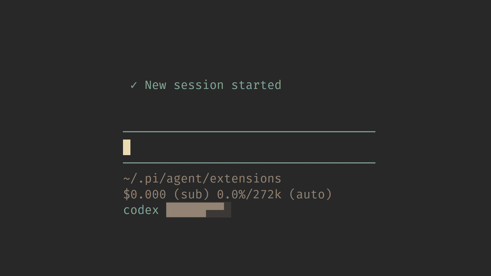

# pi-codex-usage

> Minimal zero-configuration Pi extension for showing primary ChatGPT Codex usage limits in the statusline



This repository is a minimal fork of [`narumiruna/pi-extensions/extensions/pi-codex-usage`](https://github.com/narumiruna/pi-extensions/tree/main/extensions/pi-codex-usage). It keeps the auth and quota-fetching path, but intentionally narrows the interface to the primary Codex 5-hour and weekly windows.

## Start Here

- [Agent Notes](./AGENTS.md)
- [Backlog](./BACKLOG.md)
- [Changelog](./CHANGELOG.md)

## Features

- Shows an empty statusline bar immediately, then refreshes every 30 seconds while the active Pi model uses `openai-codex`
- Statusline output stays compact, with the `codex` label accented and the quota bar drawn on a themed background
- Additional returned buckets, including Spark-specific limits, are ignored
- Pi OpenAI Codex provider auth is used first
- Codex CLI app-server remains available as a fallback
- Missing auth, subscription, plan, or quota windows are shown as `n/a`, not as an error
- Successful updates briefly redraw the bar only when a 5% segment changes
- Network/provider failures keep the last good bar briefly, then show `error`
- No commands or configuration are required

## Install

From npm:

```bash
pi install npm:@llblab/pi-codex-usage
```

From git:

```bash
pi install git:github.com/llblab/pi-codex-usage
```

## Statusline

Normal usage:

```text
codex ██████▀▀▀▀
```

The ten-character bar encodes two twenty-step limits at once: 40 total bits of quota state in 10 terminal cells. Each step is 5%: the top quadrants are the 5-hour limit, and the bottom quadrants are the weekly limit.

Unavailable because Codex auth or subscription quota is not available:

```text
codex n/a
```

Runtime failure, such as a network or provider error:

```text
codex error
```

## Auth

The extension tries usage sources in this order:

1. Pi's `openai-codex` provider auth
2. `codex app-server --listen stdio://`

OpenAI API keys are not ChatGPT Codex subscription auth and do not expose these quotas.

## License

MIT. See [`LICENSE`](./LICENSE).
